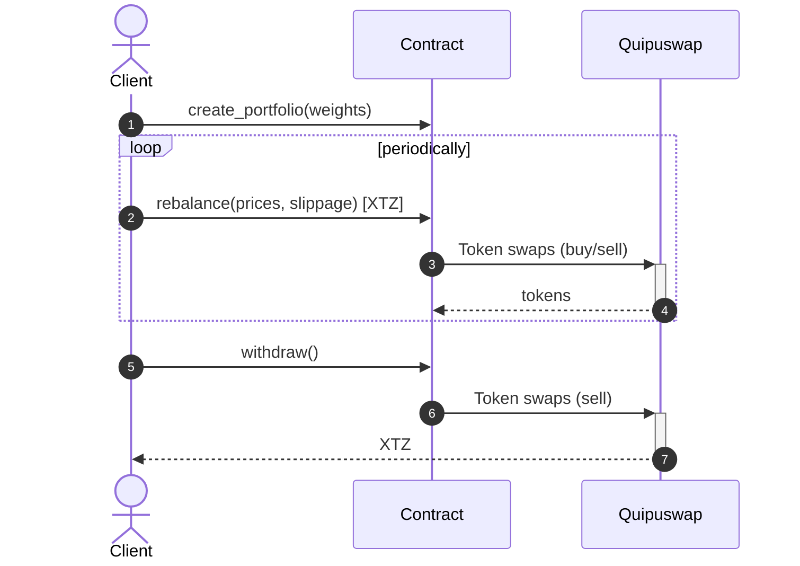
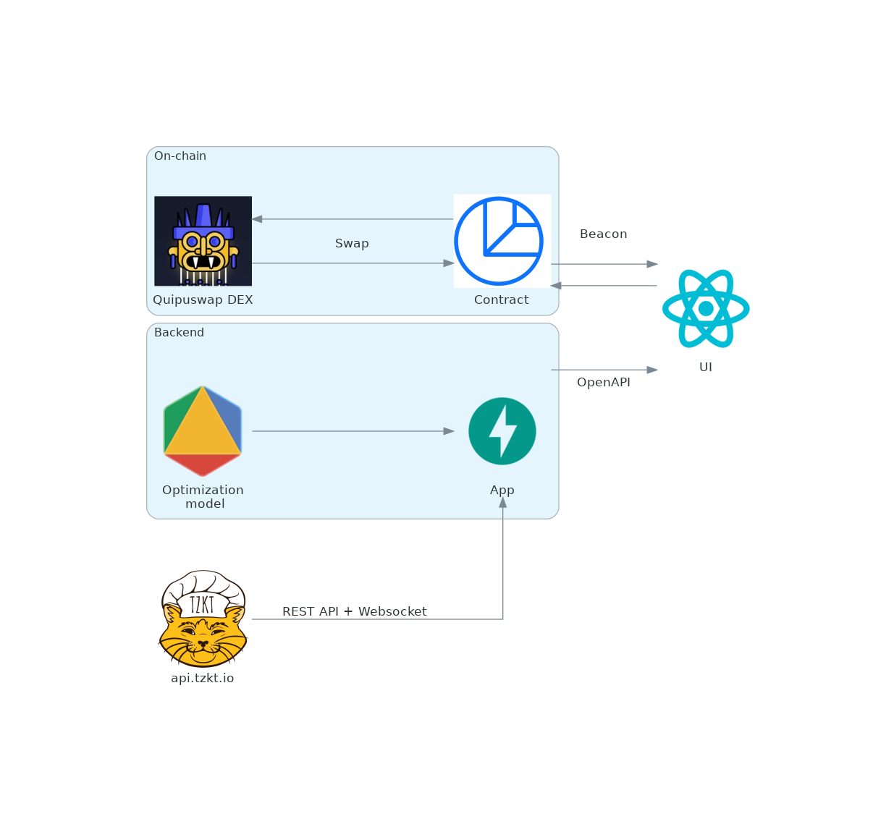

# Transacto

This is an MVP of a crypto assets management app that allows investors to store and automatically rebalance their portfolios

## Intro

[Asset allocation](https://www.investopedia.com/terms/a/assetallocation.asp) is a popular investment strategy that aims to balance risk and potentioal rewards by spreading investments across various assets. This is done by selecting a number of assets and their weights in a portfolio according to an individual's goals, risk tolerance, and investment horizon. Over time prices fluctuations can change the weightings of individual assets thus making the portfolio imbalanced. That is why a portfolio should be periodically rebalanced. Our app automates allocating tokens and rebalancing of a crypto portfolio and does this fully on-chain. 

The project consists of:
 - [Smart contract](invest): implements methods for portfolio's creation, rebalancing and withdrawal
 - [Backend module](https://github.com/tezos-invest/etfs): provides portfolios' data, handles modelling and optimizations
 - [Frontend](https://github.com/tezos-invest/web): web UI and wallet integration via [Taquito](https://tezostaquito.io)  

3rd-party dependencies:
 - Contract-level integration with [Quipuswap's](https://quipuswap.com) DEX for token trading
 - [SpicySwap's](https://spicyswap.xyz/) REST API for price history
 - [TzKT](https://tzkt.io) indexer

## User flow 

1. A user selects tokens to invest in
2. A user can generate variants of portfolios consisting of selected tokens, pareto-optimal in terms of variance-return (like a Markowitz portfolio)
3. A user specifies their desired portfolio (a list of assets they want to invest in with their weights e.g. `{tzBTC: 50%, ETHtz: 30%, KUSD: 20%}`)
4. After portfolio is created a user can call `rebalance` method attaching desired amount of TEZ to transaction. This amount of TEZ will be spread accross portfolio's assets according to specified weights. To do so it makes use of current prices of the assets and a DEX exchange to make trades
5. A user can deposit more funds or withdraw them at any time. Adding funds as well as rebalancing is done via a single call to `rebalance` method.



Current implementation has a couple of quirks that will be eliminated in the future:
- Quipuswap doesn't provide any on-chain way of retrieving current prices, so the caller of the contract should pass them as an argument
- When we buy tokens on a DEX we can't know the exact amount of tokens that will be received in advance due to price slippage. Therefore we track minimal guaranteed amounts of purchased tokens based on allowed slippage and ignore the remainders at the time of rebalancing. But these remainders are not lost - they are returned to the clients when they withdraw their funds
- SpicySwap does not provide information about hangzhou tokens. Therefore, the history of testnet tokens is mocked with other available tokens.

## Platform architecture

<p align="center">
    
</p>


## Portfolio Emulation

To emulate the state of the portfolio, we get historical data from SpicySwap API. By running through it, we periodically rebalance the portfolio taking into account the changed token values and estimate portfolio's performance on historical data.

## Portfolio Optimization

Once we have learned how to emulate a portfolio's performance, we can run a multiple-objective optimization process (MO-CMA-ES) on the expected return and volatility metrics to get the Pareto optimal points. In this case, we perform a task similar to the Markowitz portfolio optimization, taking into account that the number of tokens in the portfolio varies with their cost. As a result of optimization, user receives a list of optimal portfolios, from which he can choose the one that suits him best in terms of risk/returns ratio.

## Future plans

- Portfolio optimization methods to recommend better portfolios based on client's goals (Black-Litterman Allocation, Hierarchical Risk Parity, efficient frontier)
- Estimate the times when it's most profitable to rebalance a certain portfolio and notify clients (or we could do the rebalancing ourselves on behalf of the client)
- Allow portfolios to be "public", so they could be used as ETF-like index funds with correspondent options mechanics
- Issue special tokens that will represent shares of indexes and could be traded independently


### Compile

```bash
ligo compile contract invest/main.mligo --werror -p hangzhou -e main -o invest.tz
```

### Run tests

```bash
ligo run test -p hangzhou tests/test_invest.mligo
```
